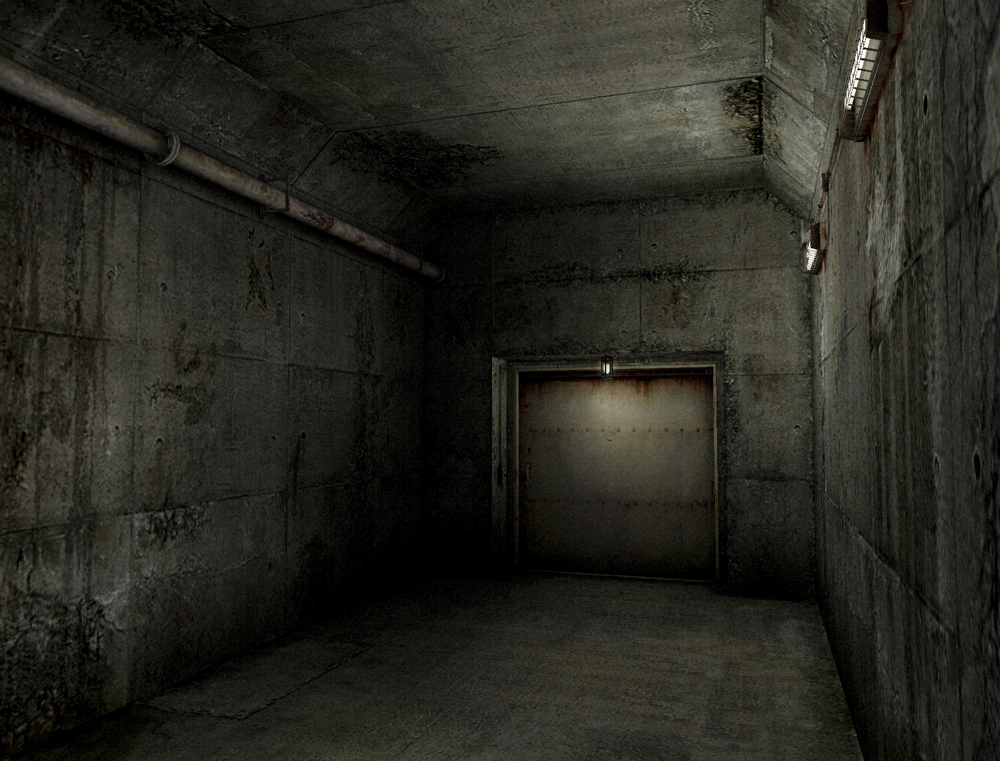

### References & Inspiration
#### Protagonist:
**[Lee](https://x.com/leedoppo)**
>*Best* character *rigging* & animation reference
> 
> Great proportion, anatomy & *topology* ref for a *teen girl* model

#### Enemies:

#### Environment:
**Silent Hill 3 (*not verified*) environment**
>Simplicity and detail balance
>
>Great value range (lightmaps do heavy lifting)

<!--  -->